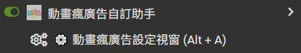
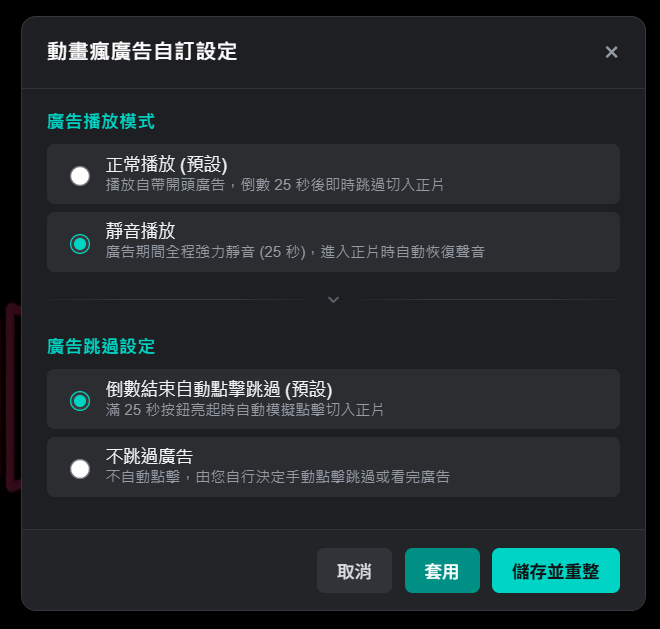

# 🎬動畫瘋廣告自訂助手

限制為動畫瘋自帶廣告（不使用 Google 廣告），25 秒準時結束直接切入正片！ 
支援<b>正常 / 靜音播放</b>、<b>手動 / 自動結束廣告</b>與專屬設定視窗，享受最純粹乾淨的觀影體驗 
同時內建一項進階的<b>獨家隱藏功能</b>供使用者自行探索

[你需要嗎](#-為什麼需要這個助手) · [主要特色](#-主要特色) · [安裝教學](#-安裝教學) · [操作設定](#-操作與設定說明) · [常見問題](#-常見問題-faq) · [免責聲明](#-免責聲明-disclaimer)

---

## ✨ 為什麼需要這個助手？

在動畫瘋看動畫時，你是否經常遇到：
- 廣告音量忽大忽小，每次開播都被突然的大音量嚇到？
- 遇到長度不可預期的 Google Ads，甚至在倒數結束後又卡住重新載入？
- 倒數結束了還要自己動手點擊跳過，稍微分心就多看了好幾秒？

**「巴哈姆特動畫瘋廣告自訂助手」** 專為解決這些日常觀影痛點而生！  
在符合官方播放規範的前提下，為你提供最高自由度的觀影自訂選項

---

## 🌟 主要特色

- 🎯 **純粹原生廣告體驗**  
  限制僅播放動畫瘋官方自帶的原生廣告，避免 Google Ads 與第三方廣告干擾

- ⚡ **25 秒精準極速跳過**  
  符合官方系統驗證標準（滿 25 秒安全門檻），時間一到立即自動載入正片，為你節省寶貴的追番時間

- 🔇 **貼心智慧靜音模式**  
  可選擇廣告期間自動切換靜音，並具備**進入正片瞬間自動恢復正常聲音**功能，完全不用擔心被廣告音量嚇到或正片也跟著被靜音等問題

- 🤖 **全自動 / 手動自由切換**  
  倒數完畢可選擇由腳本「自動點擊跳過」，或維持「手動點擊」，把觀賞決定權留給自己

- ⚙️ **專屬深色設定介面**  
  隨時按下快捷鍵 <kbd>Alt</kbd> + <kbd>A</kbd> 即可呼叫專屬設定面板，即時套用、立即生效

- 🔮 **獨家隱藏功能**  
  設定面板中內建一項特殊的進階實驗性模式，供使用者自行探索

---

## 🚀 安裝教學

### 步驟 1：安裝瀏覽器腳本管理器
請先在瀏覽器安裝任一常見的使用者腳本擴充套件（推薦使用 Chrome / Edge / Firefox / Brave）：
- [Tampermonkey (油猴)](https://www.tampermonkey.net/)（推薦）
- [Violentmonkey (暴力猴)](https://violentmonkey.github.io/)

### 步驟 2：安裝助手腳本
點擊下方連結直接進行一鍵安裝：
- 👉 **[從 GitHub Raw 安裝](https://raw.githubusercontent.com/pthuang01/ani-gamer-ad-customizer/main/ani-gamer-ad-customizer.user.js)**
- 👉 **[從 Greasy Fork 安裝](https://greasyfork.org/zh-TW/scripts/595865-%E5%B7%B4%E5%93%88%E5%A7%86%E7%89%B9%E5%8B%95%E7%95%AB%E7%98%8B%E5%BB%A3%E5%91%8A%E8%87%AA%E8%A8%82%E5%8A%A9%E6%89%8B)**

### 步驟 3：開始追番！
開啟任何 [巴哈姆特動畫瘋播放頁面](https://ani.gamer.com.tw/)，助手便會在後台自動生效運作

---

## 🎮 操作與設定說明

### 叫出設定選單

在動畫瘋播放頁面中，可以透過以下任一方式開啟設定面板：
1. **鍵盤快捷鍵**：按下 <kbd>Alt</kbd> + <kbd>A</kbd>
2. **擴充套件選單**：點擊瀏覽器右上角擴充套件圖示，選擇 **「⚙️ 動畫瘋廣告設定視窗 (Alt + A)」**

   
  <em>▲ 油猴腳本選單中的「自定義設置」入口</em>

---

### 設定選項介紹

   
  <em>▲ 彈出式設定面板</em>

#### 廣告播放模式
- **正常播放（預設）**：正常播放官方自帶開頭廣告，倒數 25 秒後即時跳過切入正片
- **靜音播放**：廣告期間全程自動強制靜音，進入正片時自動恢復聲音
- **隱藏功能**：進階實驗性功能，有興趣的話就找找看吧！

#### 廣告跳過設定
- **倒數結束自動點擊跳過（預設）**：滿 25 秒跳過按鈕亮起時，自動模擬點擊切入正片，完全無須手動操作
- **不跳過廣告**：不自動點擊，滿 25 秒後由您自行決定手動點擊跳過或看完廣告

---

## ❓ 常見問題 (FAQ)

1. **為什麼 25 秒就可以跳過？**
   * 官方系統的廣告觀看驗證門檻為 25 秒。本助手在精準滿足 25 秒官方門檻後立即為您銜接正片，既能確保正常完成計次，又不用多花時間空等
2. **使用靜音模式，會導致正片也沒有聲音嗎？**
   * 不會。腳本內建音訊狀態監聽保護機制，廣告結束切入正片的瞬間，會強制解除靜音狀態，確保正片音效正常輸出
3. **需要每次重新整理都重新設定嗎？**
   * 不需要。你的設定會自動保存在瀏覽器本地，下次打開動畫瘋依然會維持你喜好的設定
4. **遇到問題或有功能建議，該如何回報？**
   * 請前往  [GitHub Issues](https://github.com/pthuang01/ani-gamer-ad-customizer/issues) 或 [GreasyFork 反饋區](https://greasyfork.org/zh-TW/scripts/595865-%E5%B7%B4%E5%93%88%E5%A7%86%E7%89%B9%E5%8B%95%E7%95%AB%E7%98%8B%E5%BB%A3%E5%91%8A%E8%87%AA%E8%A8%82%E5%8A%A9%E6%89%8B/feedback) 提出回報與建議，感謝~

---

## 📄 免責聲明 (Disclaimer)

- 本專案為個人開源作品，僅供瀏覽器操作體驗優化與技術交流學習使用
- 本腳本並非巴哈姆特官方產品，所有動畫瘋相關商標與版權皆屬「巴哈姆特電玩資訊站」所有
- 若喜歡動畫瘋的服務，歡迎多多付費支持官方無廣告的 **「雙贏 VIP 方案」**，支持正版動漫產業！