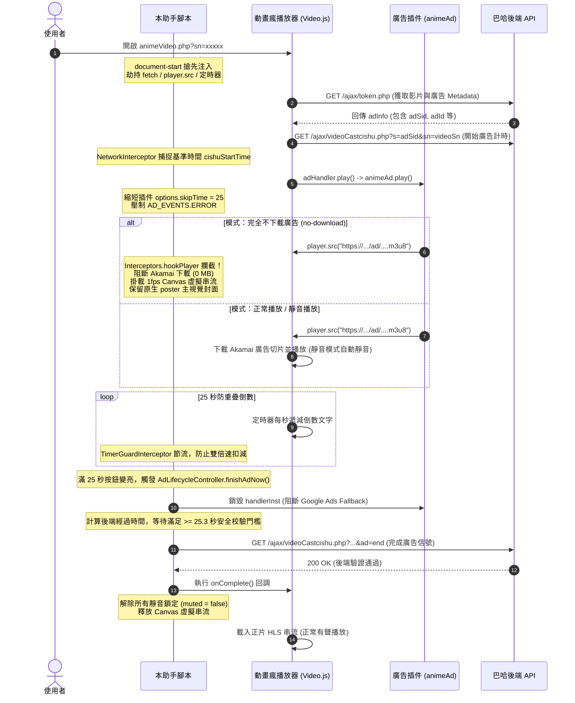

# 動畫瘋廣告自訂助手 (ani-gamer-ad-customizer) 全方位技術架構與維護手冊

> **先備知識**：具備基礎 JavaScript (ES6+) 與 Web DOM API 觀念即可，本手冊將循序漸進解構所有進階底層技術  
> **目標**：閱讀本手冊後，你將能夠完全理解 Userscript 運行機制、動畫瘋播放器逆向原理、9 大解耦模組架構

---

## 📑 目錄

- [動畫瘋廣告自訂助手 (ani-gamer-ad-customizer) 全方位技術架構與維護手冊](#動畫瘋廣告自訂助手-ani-gamer-ad-customizer-全方位技術架構與維護手冊)
  - [📑 目錄](#-目錄)
  - [Part 1: 前置必修知識庫 (Prerequisites \& Foundation)](#part-1-前置必修知識庫-prerequisites--foundation)
    - [1.1 Userscript 運行架構與油猴沙盒機制](#11-userscript-運行架構與油猴沙盒機制)
      - [執行時期注入點 (`@run-at document-start`)](#執行時期注入點-run-at-document-start)
      - [沙盒隔離與 `unsafeWindow` 的差異](#沙盒隔離與-unsafewindow-的差異)
    - [1.2 HTML5 影音架構與渲染生命週期](#12-html5-影音架構與渲染生命週期)
      - [`<video>` 元素的原生屬性與行為](#video-元素的原生屬性與行為)
    - [1.3 Video.js 播放器架構與插件事件總線](#13-videojs-播放器架構與插件事件總線)
  - [Part 2: 動畫瘋播放器逆向分析與通訊協議 (Reverse Engineering)](#part-2-動畫瘋播放器逆向分析與通訊協議-reverse-engineering)
    - [2.1 動畫瘋廣告完整加載與跳過時序圖](#21-動畫瘋廣告完整加載與跳過時序圖)
    - [2.2 後端驗證協議：`/ajax/videoCastcishu.php` 雙向交握](#22-後端驗證協議ajaxvideocastcishuphp-雙向交握)
    - [2.3 廣告回退鏈 (Fallback Chain) 與攔截防禦](#23-廣告回退鏈-fallback-chain-與攔截防禦)
    - [2.4 原生廣告動態提取 (getMajorAd / getMinorAd)](#24-原生廣告動態提取-getmajorad--getminorad)
  - [Part 3: 模組化系統架構與源碼導讀 (Architecture \& Walkthrough)](#part-3-模組化系統架構與源碼導讀-architecture--walkthrough)
    - [3.1 系統總體架構圖](#31-系統總體架構圖)
    - [3.2 核心模組逐一拆解導讀](#32-核心模組逐一拆解導讀)
      - [模組 1：ENV \& CONSTANTS (環境與常數)](#模組-1env--constants-環境與常數)
      - [模組 2：ConfigManager (設定管理)](#模組-2configmanager-設定管理)
      - [模組 3：SessionStore (集中狀態倉儲)](#模組-3sessionstore-集中狀態倉儲)
      - [模組 4：VirtualStreamService (虛擬串流與心跳)](#模組-4virtualstreamservice-虛擬串流與心跳)
      - [模組 5：AudioPolicyManager (音訊原則管理)](#模組-5audiopolicymanager-音訊原則管理)
      - [模組 6：AdLifecycleController (生命週期控制)](#模組-6adlifecyclecontroller-生命週期控制)
      - [模組 7：Interceptors (攔截器群組)](#模組-7interceptors-攔截器群組)
      - [模組 8：UIModule (視圖與特效)](#模組-8uimodule-視圖與特效)
      - [模組 9：AppBootstrap (應用啟動器)](#模組-9appbootstrap-應用啟動器)
  - [Part 4: 維護指南與除錯實戰 SOP (Maintenance \& Debugging)](#part-4-維護指南與除錯實戰-sop-maintenance--debugging)
    - [4.1 本地開發與熱載入環境配置](#41-本地開發與熱載入環境配置)
    - [4.2 官方前端改版應對與定位指南](#42-官方前端改版應對與定位指南)
      - [步驟 1：檢查 DevTools Console 關鍵標籤](#步驟-1檢查-devtools-console-關鍵標籤)
      - [步驟 2：在 Sources 面板搜尋關鍵字](#步驟-2在-sources-面板搜尋關鍵字)
      - [步驟 3：定位混淆後的廣告插件](#步驟-3定位混淆後的廣告插件)
    - [4.3 敏感常數與不可踩踏之紅線清單](#43-敏感常數與不可踩踏之紅線清單)
    - [4.4 實戰除錯技巧與 DevTools 觀測技巧](#44-實戰除錯技巧與-devtools-觀測技巧)
      - [觀察 Network 流量判定模式是否生效](#觀察-network-流量判定模式是否生效)
      - [推薦的斷點放置點 (Breakpoints)](#推薦的斷點放置點-breakpoints)
    - [4.5 常見異常情境與排查 FAQ](#45-常見異常情境與排查-faq)
      - [Q1：使用者回報廣告結束後「正片沒有聲音」？](#q1使用者回報廣告結束後正片沒有聲音)
      - [Q2：為什麼點擊跳過或倒數結束後，畫面跳出 Google Ads？](#q2為什麼點擊跳過或倒數結束後畫面跳出-google-ads)
      - [Q3：完全不下載廣告模式下，為什麼畫面變成黑屏破圖，而不是動畫主視覺海報？](#q3完全不下載廣告模式下為什麼畫面變成黑屏破圖而不是動畫主視覺海報)
  - [結語與維護心法](#結語與維護心法)

---

## Part 1: 前置必修知識庫 (Prerequisites & Foundation)

### 1.1 Userscript 運行架構與油猴沙盒機制

#### 執行時期注入點 (`@run-at document-start`)
傳統的網頁腳本往往在 `DOMContentLoaded` 或 `window.onload` 後執行，但廣告阻擋/客製化腳本必須使用 `@run-at document-start`。
* **為什麼？** 當瀏覽器剛建立 DOM tree、尚未解析 `<head>` 與 `<script>` 標籤時，我們的腳本就必須搶先注入。只有這樣，我們才能**搶在動畫瘋原生 JavaScript 載入前**，劫持原生 `fetch`、`setInterval`、`document.createElement` 與全域函數。

#### 沙盒隔離與 `unsafeWindow` 的差異
Tampermonkey 預設運行於獨立的 Execution Context（沙盒隔離環境）：
* **沙盒內的 `window`**：是一個乾淨的代理物件，具備存取專有 API（如 `GM_getValue`, `GM_setValue`）的能力，但無法直接修改宿主頁面的原生 JavaScript 變數。
* **`unsafeWindow`**：指向宿主頁面的真實全域 `window` 物件。
* **專案實踐**：
  在腳本開頭的 `ENV` 模組中，我們進行環境正規化：
  ```javascript
  const ENV = {
      get window() {
          return typeof unsafeWindow !== 'undefined' ? unsafeWindow : window;
      },
      get document() {
          return this.window.document;
      }
  };
  ```
  所有底層攔截動作（例如覆寫 `window.fetch`、`Object.defineProperty(window, 'getMajorAd', ...)`）皆必須作用在 `ENV.window`，否則無法影響巴哈姆特前端程式碼。

---

### 1.2 HTML5 影音架構與渲染生命週期

#### `<video>` 元素的原生屬性與行為
HTML5 `<video>` 不僅僅是一個單純的容器，內部具備複雜的硬體解碼與渲染管線（Media Pipeline）：
1. **`src` vs `srcObject`**：
   - `src`：接受外部 URL（如 MP4 網址或 HLS `.m3u8` 播放清單）。
   - `srcObject`：接受一個 `MediaStream` 即時串流（如來自 WebRTC 或 Canvas `captureStream`）。兩者互斥，設定一者時通常應清除另一者。
2. **`poster`（海報封面）原生渲染機制**：
   - W3C 規範明確指出：當 `<video>` 元素處於未開始播放狀態、或尚未收到**第一幀解碼可見畫面（Decoded Video Frame）**前，瀏覽器會持續呈現 `poster` 屬性所指定的靜態圖片。
   - **本專案關鍵發現**：在「完全不下載廣告」模式中，我們利用記憶體中的 Canvas 虛擬心跳串流維持播放器狀態，但不向瀏覽器推送真實畫面，從而讓瀏覽器**持續保留展示官方動畫主視覺封面**，避免了 Adblock 常見的破圖或漆黑黑屏。

---

### 1.3 Video.js 播放器架構與插件事件總線

巴哈姆特動畫瘋採用客製化的 **Video.js** 作為其 HTML5 播放器底層。理解其架構是維護本專案的關鍵：
* **Player 核心實例**：掛載於 `<video-js id="ani_video">.player`，負責提供播放狀態機（`vjs-playing`, `vjs-has-started`, `vjs-ad-playing` 等 class 控制）。
* **Tech 層**：Video.js 用來包裝原生 HTML5 `<video>` 的轉接層。當調用 `player.src(source)` 時，Video.js 會通知 Tech 層切換媒體來源。
* **廣告插件架構**：
  - `adHandler`：動畫瘋廣告中樞控制器，調度 Google IMA、Rewarded 廣告或自帶原生廣告。
  - `animeAd` / `nativeAd`：動畫瘋自製的原生廣告插件。
  - **事件總線**：廣告插件會發射 `AD_EVENTS.START`、`AD_EVENTS.END`、`AD_EVENTS.ERROR` 等事件。我們正是透過壓制其 `ERROR` 事件，杜絕播放器在廣告失敗時自動切換重播或轉向 Google Ads。

---

## Part 2: 動畫瘋播放器逆向分析與通訊協議 (Reverse Engineering)

### 2.1 動畫瘋廣告完整加載與跳過時序圖

下圖呈現了從使用者載入頁面，到腳本介入，再到正片載入的完整通訊時序：



---

### 2.2 後端驗證協議：`/ajax/videoCastcishu.php` 雙向交握

巴哈姆特伺服器防止廣告被 Adblock 秒跳的機制，不是純靠前端，而是靠後端的**時間差校驗**：

1. **廣告開始信號**：
   - 請求格式：`/ajax/videoCastcishu.php?s={adSid}&sn={videoSn}`
   - 伺服器會在 Session/Redis 中為此 `adSid` 建立時間戳記。
2. **廣告結束信號**：
   - 請求格式：`/ajax/videoCastcishu.php?s={adSid}&sn={videoSn}&ad=end`
   - 伺服器計算 `(結束時間 - 開始時間)`。
3. **安全邊界數值（極度重要）**：
   - 巴哈後端要求的時間門檻為 **25.0 秒**。
   - 若提前發送 `&ad=end`，後端會拒絕認證，導致後續換取正片金鑰時報錯或重新要求看廣告。
   - **設計決策**：本專案在 `AdLifecycleController` 中設定了嚴格的保護：
     $$\text{waitMs} = \max(0, 25300 - (\text{Date.now()} - \text{cishuStartTime}))$$
     多出 **300 毫秒（25.3 秒）** 的緩衝是為了抵消網路封包延遲與伺服器時鐘誤差，確保 100% 通過檢驗。

---

### 2.3 廣告回退鏈 (Fallback Chain) 與攔截防禦

動畫瘋原生前端有一套複雜的 Fallback 機制，其代碼隱藏在 `anime_player.js` 中：
```text
廣告請求失敗 / AD_EVENTS.ERROR 
    └──> 降級至 Google IMA Ads 
            └──> 降級至 Rewarded Ads 
                    └──> 降級至 Native Ads 
                            └──> 降級至 PAD (巴哈自帶廣告重複播)
```
* **舊版腳本常見 Bug**：若直接阻擋廣告串流，插件會拋出 `error`，觸發上述鏈條，導致使用者跳過自帶廣告後，又突然跳出 30 秒 Google 廣告。
* **防禦解法**：
  1. 覆寫 `inst.trigger`：過濾並吞掉 `error` 與 `inst.AD_EVENTS.ERROR`。
  2. 在 `finishAdNow()` 中主動呼叫 `session.handlerInst.destroy()`，直接銷毀廣告控制樹，切斷通往 Google IMA 的任何支線。

---

### 2.4 原生廣告動態提取 (getMajorAd / getMinorAd)

動畫瘋前端定義了全域函數來隨機選取官方贊助/宣傳廣告：
* `window.getMajorAd()`：取得主廣告陣列 `[adId, adUrl, adSid, "video" | "facebook", ...]`
* `window.getMinorAd()` / `window.getAd()`：取得次要廣告陣列
* **專案實踐**：
  為避免寫死 ID 或被官方設定覆蓋，腳本透過 `Object.defineProperty` 攔截 `getMajorAd` 的 getter：
  ```javascript
  Object.defineProperty(ENV.window, 'getMajorAd', {
      get() { return getDynamicNativeAd; },
      set(fn) { SessionStore.setCapturedMajorAdFn(fn); },
      configurable: false
  });
  ```
  在回傳時強制將廣告類型校正為 `video`，確保播放器一律走原生影片流程，完全排除社交連結廣告或 Google 插件。

---

## Part 3: 模組化系統架構與源碼導讀 (Architecture & Walkthrough)

### 3.1 系統總體架構圖

重構後的單檔架構具備極高的內聚力與明確的依賴邊界：

```mermaid
graph TB
    subgraph Foundation [底層基礎設施]
        ENV[ENV: 宿主環境統一包裝]
        CONSTANTS[CONSTANTS: 系統常數/閾值/選擇器]
    end

    subgraph StateAndConfig [狀態與設定層]
        ConfigManager[ConfigManager: GM 儲存與響應邏輯]
        SessionStore[SessionStore: 廣告 Session 與指標倉儲]
    end

    subgraph CoreServices [核心服務層]
        VirtualStreamService[VirtualStreamService: 1fps Canvas 虛擬串流]
        AudioPolicyManager[AudioPolicyManager: 靜音狀態自動機]
        AdLifecycleController[AdLifecycleController: 25s 完結與後端通訊]
    end

    subgraph InterceptionLayer [攔截器群組 Interceptors]
        NetHook[initNetwork: fetch 監控]
        TimerHook[initTimerGuard: setInterval 節流]
        NativeAdHook[initNativeAdData: getMajorAd 劫持]
        PlayerHook[hookPlayer: Video.js / player.src / 插件參數]
        DOMHook[initDOM: createElement / MutationObserver]
    end

    subgraph UILayer [視圖展示層 UIModule]
        Styles[CSS 樣式與動畫注入]
        ToastView[Toast 提示通知]
        ModalView[設定視窗與 1.5s 懸停抽屜]
        Shortcuts[快捷鍵 Alt+A 與選單]
    end

    subgraph Boot [啟動]
        AppBootstrap[AppBootstrap.init()]
    end

    %% 依賴關聯
    InterceptionLayer --> CoreServices
    InterceptionLayer --> SessionStore
    AdLifecycleController --> AudioPolicyManager
    AdLifecycleController --> SessionStore
    AudioPolicyManager --> ConfigManager
    AudioPolicyManager --> SessionStore
    UILayer --> ConfigManager
    UILayer --> AudioPolicyManager
    AppBootstrap --> InterceptionLayer
    AppBootstrap --> UILayer
```

---

### 3.2 核心模組逐一拆解導讀

#### 模組 1：ENV & CONSTANTS (環境與常數)
* **位置**：約第 20–60 行
* **設計意圖**：集中所有「魔法數字（Magic Numbers）」與環境存取。禁止在後續業務邏輯中散落字串或毫秒數字。
* **關鍵常數**：
  - `TARGET_SKIP_TIME: 25`：廣告跳過秒數。
  - `MIN_BACKEND_ELAPSED_MS: 25300`：後端校驗安全門檻。
  - `COUNTDOWN_THROTTLE_MS: 900`：計時器防重複觸發最小間隔。
  - `UNLOCK_HOVER_SECONDS: 1.5`：設定視窗隱藏功能懸停解鎖時間。

#### 模組 2：ConfigManager (設定管理)
* **位置**：約第 62–95 行
* **設計意圖**：封裝油猴 `GM_getValue` / `GM_setValue`，並提供狀態約束保證。
* **核心邏輯**：
  ```javascript
  get skipMode() {
      // 若為「完全不下載廣告」，因為畫面無廣告可看，強制限定為自動跳過
      if (this.playMode === 'no-download') {
          return 'auto';
      }
      return GM_getValue(CONSTANTS.STORAGE_KEYS.SKIP_MODE, 'auto');
  }
  ```

#### 模組 3：SessionStore (集中狀態倉儲)
* **位置**：約第 97–160 行
* **設計意圖**：消滅過去散落在 IIFE 頂層的 8 個 `let` 變數。透過閉包（Closure）提供 Get/Set API，避免變數被外部意外污染。
* **託管狀態**：
  - `currentAdSession`：當前廣告實例（含 `videoSn`, `adInfo`, `onComplete` 等）。
  - `cishuStartTime`：後端起始握手時間戳。
  - `activePlayer`：當前 Video.js 播放器參照。
  - `adCountdownIntervalId` & `lastTickTime`：定時器防護狀態。

#### 模組 4：VirtualStreamService (虛擬串流與心跳)
* **位置**：約第 162–200 行
* **設計意圖**：支撐「完全不下載廣告」模式的核心技術。
* **深層技術細節**：
  1. 建立 16×16 的 Detached Canvas（不加入 DOM 樹）。
  2. 調用 `canvas.captureStream(1)` 獲取 1fps 串流。
  3. **心跳機制**：透過 `setInterval` 每秒在 `#000000` 與 `#010101` 之間交替繪製微小色差。
     - **為什麼要微幅切換顏色？** 若 Canvas 像素完全靜止，部分 Chromium/Firefox 版本的 `MediaStream` 繪圖管線會進入休眠（Idle），進而觸發 Video.js 的 `waiting` 或 `stalled` 事件而卡死；微小的心跳能騙過瀏覽器維持串流活躍。
  4. **海報封面保留**：因為虛擬串流沒有向 GPU 提交真實影片幀，瀏覽器不會隱藏 `<video poster="...">`，使用者能優雅地看著動畫主視覺等待 25 秒。

#### 模組 5：AudioPolicyManager (音訊原則管理)
* **位置**：約第 202–245 行
* **設計意圖**：徹底解決「廣告靜音但正片也跟著靜音」的歷史頑疾。
* **判定矩陣**：
  | 當前狀態 | 播放模式 | `videoElem.muted` | `player.muted()` |
  | :--- | :--- | :--- | :--- |
  | 廣告播放中 | `muted` 或 `no-download` | `true` (強制靜音) | `true` |
  | 廣告播放中 | `normal` | `false` (正常發聲) | `false` |
  | **正片播放中** | **任意模式** | **`false` (強制解鎖)** | **`false` (強制解鎖)** |

#### 模組 6：AdLifecycleController (生命週期控制)
* **位置**：約第 247–305 行
* **設計意圖**：廣告「結束」的單一權限中心（Single Point of Truth）。
* **執行流程 (`finishAdNow`)**：
  1. `session.ended = true` 防止重入。
  2. 調用 `session.handlerInst.destroy()` 掐斷 Fallback 鏈。
  3. 移除 DOM 上的 `.vjs-anigamer-ad-playing`, `.vast-blocker`, `#adSkipButton`。
  4. 調用 `AudioPolicyManager.applyPolicy()` 解除靜音。
  5. 計算安全延遲發送 `&ad=end`。
  6. 執行 `session.onComplete()` 換取正片播放清單。

#### 模組 7：Interceptors (攔截器群組)
* **位置**：約第 307–540 行
* **包含子攔截器**：
  - `initNetwork()`：劫持 `window.fetch`，解析 `/ajax/videoCastcishu.php`。
  - `initTimerGuard()`：劫持 `window.setInterval`，監聽字串帶有 `skipText` 的計時器，強制加入 900ms 節流，徹底解決多個計時器疊加導致 2 秒跳完廣告的異常。
  - `initNativeAdData()`：劫持 `getMajorAd`，回傳原生 video 廣告資料。
  - `hookPlayer(player)`：
    * 壓制廣告期間的 `player.error` 與 `animeMask.showError` 彈窗。
    * 攔截 `adHandler.play` 捕獲 Session。
    * 縮短插件倒數參數 `options.skipTime = 25`。
    * 覆寫 `player.src`：將廣告串流無縫替換為 `VirtualStreamService.getStream()`。
  - `initDOM()`：
    * 攔截 `createElement('video-js')` 第一時間掛鉤 Player。
    * 攔截 `createElement('source')` 抹除預載 `welcome_to_anigamer.mp4`。
    * 透過 `MutationObserver` 監聽 `#adSkipButton`，進行文字校正與自動點擊。

#### 模組 8：UIModule (視圖與特效)
* **位置**：約第 542–850 行
* **特色功能**：
  - **純 CSS 動畫**：包含 `@keyframes aniRainbowSpin`、`aniRainbowFade` 等，全採硬體加速。
  - **1.5 秒懸停解鎖**：
    - 分隔線未展開時，監聽 `mouseenter` 啟動 1.5 秒計時器。
    - 滿 1.5 秒啟動發光特效並標記 `isGlowActive = true`。
    - 點擊時檢查 `isGlowActive`，未解鎖前點擊無效；解鎖後觸發七彩流光、Toast 通知並展開抽屜。
  - **設定同步**：即時套用（`ani-btn-apply`）無需重整頁面，點擊「儲存並重整」（`ani-btn-save-reload`）則刷新套用。

#### 模組 9：AppBootstrap (應用啟動器)
* **位置**：約第 852–865 行
* **職責**：唯一的入口函式，按正確依賴順序呼叫攔截器與 UI 註冊，印出啟動日誌。

---

## Part 4: 維護指南與除錯實戰 SOP (Maintenance & Debugging)

### 4.1 本地開發與熱載入環境配置

剛接手專案時，若每次修改都要複製貼上到 Tampermonkey 編輯器會非常痛苦。推薦採用**本機檔案直連法**：

1. **開啟 Chrome 擴充功能設定**：
   - 進入 `chrome://extensions/`。
   - 找到 Tampermonkey，開啟 **「允許存取檔案網址 (Allow access to file URLs)」**。
2. **在 Tampermonkey 新增開發專用腳本**：
   - 內容僅需保留 Header，主體透過 `@require` 指向本機檔案：
   ```javascript
   // ==UserScript==
   // @name         動畫瘋廣告助手 (Local Dev)
   // @match        https://ani.gamer.com.tw/animeVideo.php?sn=*
   // @run-at       document-start
   // @grant        GM_setValue
   // @grant        GM_getValue
   // @grant        GM_registerMenuCommand
   // @grant        unsafeWindow
   // @require      file:///C:/Users/pthua/Downloads/動畫瘋廣告腳本/ani-gamer-ad-customizer.user.js
   // ==/UserScript==
   ```
3. **享受即時熱除錯**：在本機 VS Code 存檔後，重新整理動畫瘋頁面即可立即驗證，無需重複安裝！

---

### 4.2 官方前端改版應對與定位指南

巴哈姆特若更新前端播放器（通常是 `anime_player.js` 版本號變動，如 `?v=1789355980`），請遵循以下 SOP 進行定位：

#### 步驟 1：檢查 DevTools Console 關鍵標籤
開啟 F12 Console，過濾 `[動畫瘋助手]`：
* 若沒有印出 `[動畫瘋助手] 模組初始化完成` ➔ 檢查 `@run-at` 或環境變數。
* 若沒有印出 `成功攔截 adHandler.play` ➔ 官方可能重構了廣告掛載方法。

#### 步驟 2：在 Sources 面板搜尋關鍵字
開啟 DevTools ➔ 按 <kbd>Ctrl</kbd> + <kbd>Shift</kbd> + <kbd>F</kbd> 全域搜尋：
1. 搜尋 `videoCastcishu` ➔ 確認後端開始/結束計時 API 的參數名稱是否變更。
2. 搜尋 `getMajorAd` 或 `getMinorAd` ➔ 確認官方是否修改了自帶廣告函式名稱。
3. 搜尋 `adHandler` 或 `animeAd` ➔ 確認 Video.js 插件名稱是否改變。

#### 步驟 3：定位混淆後的廣告插件
若官方代碼被高度壓縮混淆（例如代碼變成 `#m()`, `#p()`）：
* 在 Sources 面板中找到 `anime_player.js`。
* 搜尋字串 `skipTime` 或 `skipCountDown`，該處即為廣告插件的設定進入點。

---

### 4.3 敏感常數與不可踩踏之紅線清單

維護時，以下參數**千萬不可任意改動**：

| 參數 / 邏輯 | 當前設定值 | 絕對不可改動的原因 |
| :--- | :--- | :--- |
| `MIN_BACKEND_ELAPSED_MS` | `25300` (25.3s) | **後端硬性防線**：巴哈伺服器以 25.0 秒為合格基準。若調小於 25000，伺服器會直接拒發金鑰，造成影片全黑報錯。 |
| `TARGET_SKIP_TIME` | `25` | 前端顯示倒數，需與後端 25 秒嚴格同步。 |
| `COUNTDOWN_THROTTLE_MS` | `900` | 若調小於 500ms，當頁面因多重計時器疊加時，會引發快速扣秒，導致前端計時跑完但後端未滿 25 秒的死鎖。 |
| `UNLOCK_HOVER_SECONDS` | `1.5` | 避免使用者滑鼠快速掠過時意外觸發七彩流光與隱藏抽屜。 |
| Canvas 心跳間隔 | `1000` (1s) | 不可移除此定時器，否則 Chromium 繪圖管線會將 Detached Canvas 判定為凍結而使播放器進入 Buffer Stalled。 |

---

### 4.4 實戰除錯技巧與 DevTools 觀測技巧

#### 觀察 Network 流量判定模式是否生效
* **切換至「完全不下載廣告」模式**：
  - 在 Network 面板過濾 `ts` 或 `m3u8`。
  - 前 25 秒內，**絕對不能出現來自 `akamai` 或 `/ad/` 的分段切片請求**。
  - 滿 25 秒後，應看見 `/ajax/videoCastcishu.php?...&ad=end`，隨後立刻出現正片的 `.m3u8` 與首個正片 `video.ts`。

#### 推薦的斷點放置點 (Breakpoints)
1. [`Interceptors.initNetwork`](file:///c:/Users/pthua/Downloads/動畫瘋廣告腳本/ani-gamer-ad-customizer.user.js#L309)：中斷於 `fetch` 攔截點，檢查 `cishuStartTime` 是否順利取得。
2. [`AdLifecycleController.finishAdNow`](file:///c:/Users/pthua/Downloads/動畫瘋廣告腳本/ani-gamer-ad-customizer.user.js#L248)：檢查 `elapsedMs` 是否大於 25,000ms。
3. [`PlayerInterceptor.player.src`](file:///c:/Users/pthua/Downloads/動畫瘋廣告腳本/ani-gamer-ad-customizer.user.js#L442)：檢查 `isAd` 判斷是否正確辨識出廣告網址。

---

### 4.5 常見異常情境與排查 FAQ

#### Q1：使用者回報廣告結束後「正片沒有聲音」？
* **可能原因**：瀏覽器的 Autoplay Policy 攔截了非靜音播放，或是原生播放器未觸發 `volumechange`。
* **排查方法**：
  檢查 [`AudioPolicyManager.applyPolicy()`](file:///c:/Users/pthua/Downloads/動畫瘋廣告腳本/ani-gamer-ad-customizer.user.js#L221)。在正片播放時，腳本會雙重解除靜音：
  ```javascript
  videoElem.muted = false;
  player.muted(false);
  ```
  確保調用時 `player` 實例存在，且確認正片元素未被附加 `vjs-anigamer-ad-playing` class。

#### Q2：為什麼點擊跳過或倒數結束後，畫面跳出 Google Ads？
* **可能原因**：廣告實例在結束時未被徹底 Destroy，觸發了原生播放器的 Fallback。
* **排查方法**：
  檢查 [`AdLifecycleController.finishAdNow()`](file:///c:/Users/pthua/Downloads/動畫瘋廣告腳本/ani-gamer-ad-customizer.user.js#L257) 中的：
  ```javascript
  if (session.handlerInst && typeof session.handlerInst.destroy === 'function') {
      session.handlerInst.destroy();
  }
  ```
  若官方重構了 `adHandler` 旗下物件，確認該實例的銷毀函式是否改名（如 `dispose()` 或 `clean()`）。

#### Q3：完全不下載廣告模式下，為什麼畫面變成黑屏破圖，而不是動畫主視覺海報？
* **可能原因**：原生 `<video>` 標籤的 `poster` 屬性被清除，或是被其他第三方樣式覆蓋。
* **排查方法**：
  在 Console 輸入 `document.querySelector('#ani_video_html5_api').poster`，確認該網址是否存在且有效。同時確認 `Interceptors.hookPlayer` 中沒有誤呼叫 `videoElem.removeAttribute('poster')`。

---

## 結語與維護心法

> **「防禦性編程（Defensive Programming）是逆向工程腳本的靈魂。」**  
> 官方前端代碼隨時可能微調變數名或非同步時序。在未來的維護過程中，新增任何攔截邏輯時，請務必遵循重構後的架構規範：
> 1. **狀態歸於 `SessionStore`**，切勿重蹈覆轍宣告頂層全域變數。
> 2. **副作用歸於 `AdLifecycleController`**，確保資源清理與後端驗證對稱。
> 3. **UI 歸於 `UIModule`**，保持影音核心邏輯的乾淨純粹。
